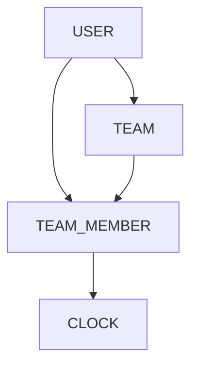

# Database Schema - EarlyBird

## Overview

This document describes the database schema for the EarlyBird application, a time tracking system built with **Symfony 6.x**, **Doctrine ORM**, and **PostgreSQL**.

---

## Database Schema Diagram

---

## Tables

### User

Stores user account information and authentication data.

| Column       | Type         | Constraints                     | Description                          |
|--------------|--------------|---------------------------------|--------------------------------------|
| id           | INT          | PK, AUTO_INCREMENT              | Unique identifier                    |
| firstname    | VARCHAR(255) | NOT NULL                        | User's first name                    |
| lastname     | VARCHAR(255) | NOT NULL                        | User's last name                     |
| email        | VARCHAR(255) | NOT NULL, UNIQUE                | User's email (used for login)        |
| phone_number | VARCHAR(255) | NOT NULL                        | User's phone number                  |
| password     | VARCHAR(255) | NOT NULL                        | Hashed password                      |
| role         | VARCHAR(255) | NOT NULL, DEFAULT ROLE_EMPLOYEE | User role                            |
| code_pin     | INT          | NULLABLE                        | Optional PIN code                    |

---

### Team

Represents a team/group of users with a designated manager.

| Column      | Type         | Constraints                              | Description      |
|-------------|--------------|------------------------------------------|------------------|
| id          | INT          | PK, AUTO_INCREMENT                       | Unique identifier|
| name        | VARCHAR(255) | NOT NULL                                 | Team name        |
| description | TEXT         | NULLABLE                                 | Team description |
| manager_id  | INT          | FK User, UNIQUE, NULLABLE, ON DELETE SET NULL | Team manager |

---

### TeamMember

Join table linking users to teams with work schedule information.

| Column     | Type | Constraints                        | Description               |
|------------|------|------------------------------------|---------------------------|
| id         | INT  | PK, AUTO_INCREMENT                 | Unique identifier         |
| team_id    | INT  | FK Team, NOT NULL, ON DELETE CASCADE  | Associated team        |
| user_id    | INT  | FK User, NOT NULL, ON DELETE CASCADE  | Associated user        |
| start_time | TIME | NULLABLE                           | Scheduled work start time |
| end_time   | TIME | NULLABLE                           | Scheduled work end time   |

---

### Clock

Records clock-in and clock-out events for team members.

| Column         | Type        | Constraints                              | Description              |
|----------------|-------------|------------------------------------------|--------------------------|
| id             | INT         | PK, AUTO_INCREMENT                       | Unique identifier        |
| team_member_id | INT         | FK TeamMember, NOT NULL, ON DELETE CASCADE | Associated team member |
| timestamp      | DATETIME    | NOT NULL                                 | Time of the clock event  |
| type           | VARCHAR(20) | NOT NULL                                 | arrival or departure     |

---

### RefreshTokens

Stores JWT refresh tokens for authentication.

| Column        | Type         | Constraints      | Description              |
|---------------|--------------|------------------|--------------------------|
| id            | SERIAL       | PK               | Unique identifier        |
| refresh_token | VARCHAR(128) | NOT NULL, UNIQUE | The refresh token string |
| username      | VARCHAR(255) | NOT NULL         | Associated username      |
| valid         | TIMESTAMP    | NOT NULL         | Token expiration         |

---

## Relationships

| Parent       | Child       | Type        | On Delete |
|--------------|-------------|-------------|-----------|
| User         | Team        | One-to-Many | SET NULL  |
| User         | TeamMember  | One-to-Many | CASCADE   |
| Team         | TeamMember  | One-to-Many | CASCADE   |
| TeamMember   | Clock       | One-to-Many | CASCADE   |

---

## Source Files

- `earlybird-back/src/Entity/User.php`
- `earlybird-back/src/Entity/Team.php`
- `earlybird-back/src/Entity/TeamMember.php`
- `earlybird-back/src/Entity/Clock.php`
- `earlybird-back/migrations/`
