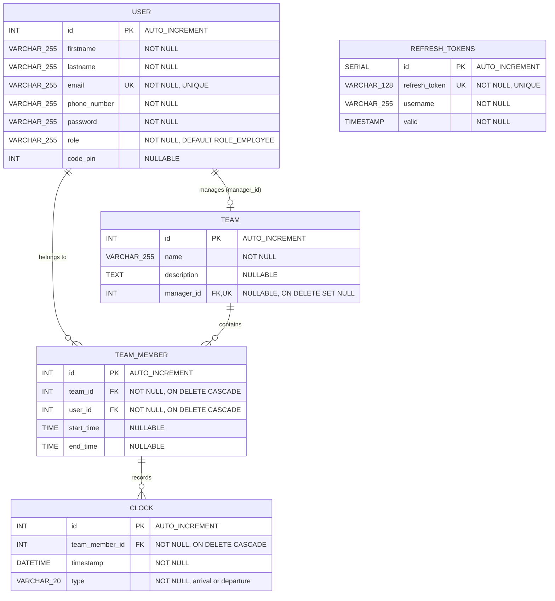
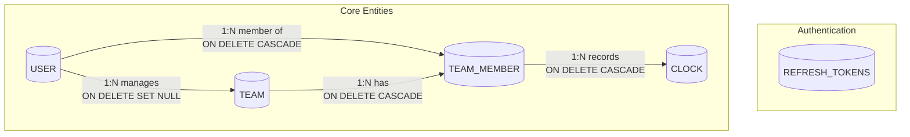
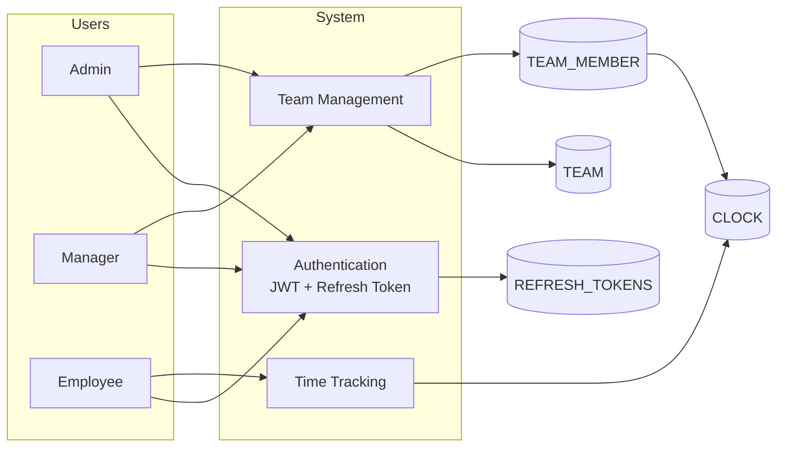

# Database Schema - EarlyBird

## Overview

This document describes the database schema for the EarlyBird application, a time tracking system built with **Symfony 6.x**, **Doctrine ORM**, and **PostgreSQL**.

---

## Entity Relationship Diagram

## Visual Relationship Diagram

## Data Flow Diagram

---

## Tables

### User

Stores user account information and authentication data.

| Column       | Type         | Constraints              | Description                          |
|--------------|--------------|--------------------------|--------------------------------------|
| id           | INT          | PK, AUTO_INCREMENT       | Unique identifier                    |
| firstname    | VARCHAR(255) | NOT NULL                 | User's first name                    |
| lastname     | VARCHAR(255) | NOT NULL                 | User's last name                     |
| email        | VARCHAR(255) | NOT NULL, UNIQUE         | User's email (used for login)        |
| phone_number | VARCHAR(255) | NOT NULL                 | User's phone number                  |
| password     | VARCHAR(255) | NOT NULL                 | Hashed password                      |
| role         | VARCHAR(255) | NOT NULL, DEFAULT 'ROLE_EMPLOYEE' | User role (ROLE_ADMIN, ROLE_MANAGER, ROLE_EMPLOYEE) |
| code_pin     | INT          | NULLABLE                 | Optional PIN code                    |

---

### Team

Represents a team/group of users with a designated manager.

| Column      | Type         | Constraints                    | Description                |
|-------------|--------------|--------------------------------|----------------------------|
| id          | INT          | PK, AUTO_INCREMENT             | Unique identifier          |
| name        | VARCHAR(255) | NOT NULL                       | Team name                  |
| description | TEXT         | NULLABLE                       | Team description           |
| manager_id  | INT          | FK → User(id), UNIQUE, NULLABLE, ON DELETE SET NULL | Team manager |

---

### TeamMember

Join table linking users to teams with work schedule information.

| Column     | Type | Constraints                              | Description                    |
|------------|------|------------------------------------------|--------------------------------|
| id         | INT  | PK, AUTO_INCREMENT                       | Unique identifier              |
| team_id    | INT  | FK → Team(id), NOT NULL, ON DELETE CASCADE | Associated team              |
| user_id    | INT  | FK → User(id), NOT NULL, ON DELETE CASCADE | Associated user              |
| start_time | TIME | NULLABLE                                 | Scheduled work start time      |
| end_time   | TIME | NULLABLE                                 | Scheduled work end time        |

---

### Clock

Records clock-in and clock-out events for team members.

| Column         | Type         | Constraints                                    | Description                        |
|----------------|--------------|------------------------------------------------|------------------------------------|
| id             | INT          | PK, AUTO_INCREMENT                             | Unique identifier                  |
| team_member_id | INT          | FK → TeamMember(id), NOT NULL, ON DELETE CASCADE | Associated team membership       |
| timestamp      | DATETIME     | NOT NULL                                       | Time of the clock event            |
| type           | VARCHAR(20)  | NOT NULL                                       | Event type: `arrival` or `departure` |

---

### RefreshTokens

Stores JWT refresh tokens for authentication.

| Column        | Type         | Constraints        | Description                    |
|---------------|--------------|--------------------|--------------------------------|
| id            | SERIAL       | PK                 | Unique identifier              |
| refresh_token | VARCHAR(128) | NOT NULL, UNIQUE   | The refresh token string       |
| username      | VARCHAR(255) | NOT NULL           | Associated username            |
| valid         | TIMESTAMP    | NOT NULL           | Token expiration timestamp     |

**Indexes:**
- `idx_refresh_token` on `refresh_token`
- `idx_refresh_token_username` on `username`

---

## Relationships

| Parent Entity | Child Entity | Relationship | Description                                      |
|---------------|--------------|--------------|--------------------------------------------------|
| User          | Team         | One-to-Many  | A user (manager) can manage multiple teams       |
| Team          | TeamMember   | One-to-Many  | A team has multiple members                      |
| User          | TeamMember   | One-to-Many  | A user can be a member of multiple teams         |
| TeamMember    | Clock        | One-to-Many  | A team member has multiple clock entries         |

---

## Cascade Behavior

| Relation                | On Delete    |
|-------------------------|--------------|
| Team → Manager (User)   | SET NULL     |
| TeamMember → Team       | CASCADE      |
| TeamMember → User       | CASCADE      |
| Clock → TeamMember      | CASCADE      |

---

## Source Files

- `earlybird-back/src/Entity/User.php`
- `earlybird-back/src/Entity/Team.php`
- `earlybird-back/src/Entity/TeamMember.php`
- `earlybird-back/src/Entity/Clock.php`
- `earlybird-back/migrations/`
