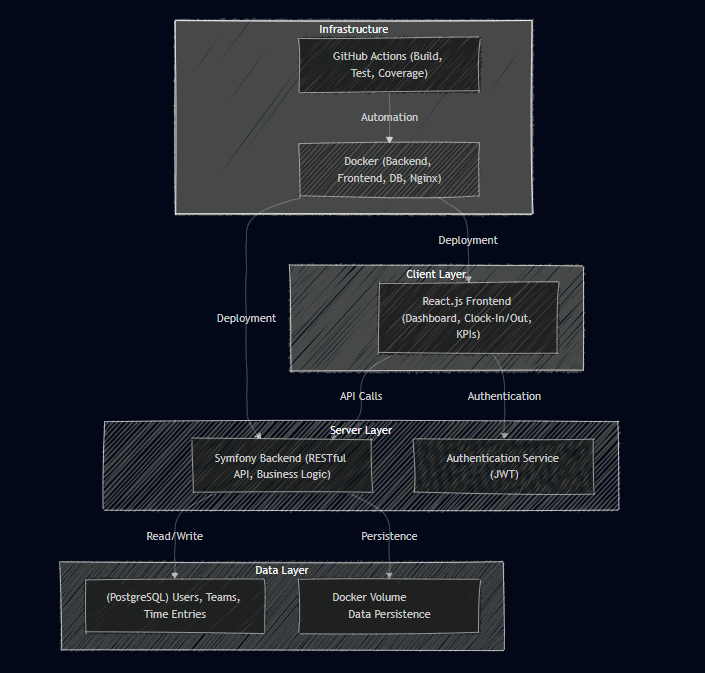

# **EarlyBird – Documentation Technique**
*Application de gestion des temps de travail (Clock-In/Clock-Out) avec KPIs*

---

## **1. Contexte et Objectifs**
**Time Manager** est une application permettant aux **employés** d’enregistrer leurs heures d’arrivée/départ et aux **managers** de gérer les équipes et consulter des KPIs.
**Objectifs** :
- Suivi des heures de travail en temps réel.
- Génération de **rapports et KPIs** (ex: taux de retard, heures moyennes).
- Gestion des **utilisateurs et équipes** (CRUD).
- **Sécurité** : Authentification par JWT, gestion des rôles.

**Philosophie DevOps** :
- Automatisation des tests, builds et déploiements.
- Utilisation de **Docker** et **GitHub Actions** pour une intégration continue.

---

## **2. Choix Technologiques**

| **Couche**          | **Technologie**               | **Justification**                                                                 |
|---------------------|-------------------------------|-----------------------------------------------------------------------------------|
| **Frontend**        | React.js                      | Framework moderne pour une UI réactive et scalable.                              |
| **Backend**         | PHP (Symfony)                 | Framework robuste pour les API REST, sécurité, et gestion des bases de données.   |
| **Base de données** | PostgreSQL                    | Base de données relationnelle fiable, supportée par Symfony.                     |
| **Authentification**| JWT                           | Sécurisation des requêtes API et gestion des sessions.                           |
| **Tests Backend**   | PHPUnit                       | Tests unitaires et fonctionnels pour les routes API.                             |
| **Tests Frontend**  | Jest                          | Tests des composants React.                                                      |
| **CI/CD**           | GitHub Actions                | Automatisation des builds, tests, et déploiements.                               |
| **Conteneurisation**| Docker + Docker Compose       | Environnements reproductibles pour le développement et la production.            |
| **Reverse Proxy**   | Nginx                         | Routing des requêtes vers le frontend/backend et exposition des ports publics.    |
| **Stockage**        | Volumes Docker (persistance)  | Persistance des données de la base et des fichiers.                              |
| **Notifications**   | Mailpit (fake SMTP)           | Simulation d’envoi d’emails pour les rappels/notifications.                      |

---

## **3. Architecture Globale**
L’application suit une **architecture monolithique modulaire** (backend + frontend séparés, conteneurisés).
Schéma d’architecture :



---
### **3.1. Description des Composants**

#### **Frontend (React.js)**
- **Pages** :
  - Connexion/Inscription (`/login`).
  - Tableau de bord (heures travaillées, KPIs).
  - Gestion des utilisateurs/équipes (réservée aux managers).
  - Historique des pointages (`/clocks`).
- **Bibliothèques** :
  - `axios` pour les requêtes API.
  - `react-router-dom` pour la navigation.
  - `Chart.js` pour les graphiques de KPIs.

#### **Backend (Symfony)**
- **Modules** :
  - **Auth** : Inscription/connexion, génération de tokens JWT.
  - **Users** : CRUD pour les utilisateurs (employés/managers).
  - **Teams** : CRUD pour les équipes.
  - **Clocks** : Enregistrement des heures d’arrivée/départ.
  - **Reports** : Génération de rapports et KPIs.
- **Routes API** (exemples) :
  | Méthode | Endpoint                  | Description                                  |
  |---------|---------------------------|----------------------------------------------|
  | POST    | `/api/login`              | Authentification (retourne un token JWT).    |
  | GET     | `/api/users`              | Liste des utilisateurs (manager seulement).  |
  | POST    | `/api/clocks`             | Enregistrer une arrivée/départ.              |
  | GET     | `/api/reports`            | Rapports globaux (KPIs).                     |

#### **Base de données (PostgreSQL)**
- **Tables principales** :
  ```sql
  CREATE TABLE users (
      id SERIAL PRIMARY KEY,
      email VARCHAR(255) UNIQUE,
      password VARCHAR(255),
      role ENUM('employee', 'manager'),
      first_name VARCHAR(255),
      last_name VARCHAR(255)
  );

  CREATE TABLE teams (
      id SERIAL PRIMARY KEY,
      name VARCHAR(255),
      description TEXT,
      manager_id INT REFERENCES users(id)
  );

  CREATE TABLE clocks (
      id SERIAL PRIMARY KEY,
      user_id INT REFERENCES users(id),
      clock_in TIMESTAMP,
      clock_out TIMESTAMP NULL,
      date DATE
  );
  ```

#### **Docker**
- **Fichiers** :
  - `docker-compose.yml` : Services pour dev (backend, frontend, DB, Nginx).
  - `docker-compose.prod.yml` : Configuration pour la production.
- **Exemple de service** :
  ```yaml
  services:
    backend:
      build: ./backend
      ports:
        - "8000:8000"
      depends_on:
        - db
      environment:
        - DATABASE_URL=postgresql://user:pass@db:5432/timemanager
  ```

#### **GitHub Actions**
- **Workflow CI** :
  ```yaml
  jobs:
    test:
      runs-on: ubuntu-latest
      steps:
        - uses: actions/checkout@v4
        - run: docker-compose up -d
        - run: docker-compose exec backend php bin/phpunit
        - run: docker-compose exec frontend npm test
  ```

---
## **4. Flux Principaux**

### **4.1. Authentification**
1. L’utilisateur se connecte via `/login` (email + mot de passe).
2. Le backend génère un **token JWT** et le retourne.
3. Le frontend stocke le token et l’inclut dans les headers des requêtes (`Authorization: Bearer <token>`).

### **4.2. Pointage des Heures**
1. L’employé clique sur "Clock-In" → Le frontend envoie un `POST /api/clocks` avec `clock_in`.
2. Le backend enregistre l’heure dans la table `clocks`.
3. Pour "Clock-Out", le frontend envoie un `PATCH /api/clocks/{id}` avec `clock_out`.

### **4.3. Génération de Rapports**
1. Le manager sélectionne une période et une équipe.
2. Le frontend appelle `GET /api/reports?team_id=1&start_date=2025-01-01&end_date=2025-01-31`.
3. Le backend calcule les KPIs (ex: moyenne d’heures/jour) et retourne les données.

---
## **5. Sécurité**
- **Rôles** :
  - **Employee** : Accès à son dashboard et pointages.
  - **Manager** : Accès aux rapports d’équipe et gestion des utilisateurs.
- **Middleware Symfony** :
  ```php
  // Exemple de contrôle d'accès
  #[IsGranted('ROLE_MANAGER')]
  public function getTeamReport(int $teamId): JsonResponse { ... }
  ```
- **Bonnes pratiques** :
  - Mots de passe hashés (bcrypt).
  - Validation des entrées (ex: `clock_in` < `clock_out`).
  - Protection CSRF pour les formulaires.

---
## **6. KPIs Implémentés**
1. **Taux de retard** :
   - `% d’arrivées après 9h00`.
2. **Heures moyennes par jour** :
   - `SUM(clock_out - clock_in) / COUNT(*)` par utilisateur/équipe.

---
## **7. DevOps et Déploiement**
- **Docker Compose** :
  - **Dev** : Services avec hot-reload (ex: `volumes` pour le code).
  - **Prod** : Build optimisé, ports exposés via Nginx.
- **GitHub Actions** :
  - Lancement des tests à chaque push.
  - Génération d’un rapport de couverture (ex: `phpunit --coverage-text`).
- **Reverse Proxy (Nginx)** :
  - Routing :
    - `/api/*` → Backend Symfony.
    - `/*` → Frontend React.

---
## **8. Tests**
- **Backend** :
  ```php
  public function testClockIn(): void
  {
      $client = static::createClient();
      $client->request('POST', '/api/clocks', ['json' => ['user_id' => 1]]);
      $this->assertResponseStatusCodeSame(201);
  }
  ```
- **Frontend** :
  ```javascript
  test('renders login form', () => {
      render(<Login />);
      expect(screen.getByLabelText('Email')).toBeInTheDocument();
  });
  ```

---
## **9. Accessibilité et UX**
- **Critères** :
  - Contraste des couleurs (WCAG).
  - Navigation clavier.
  - Messages d’erreur clairs.
- **Outils** :
  - Lighthouse (audit automatisé).
  - Axe (tests d’accessibilité).

---
## **10. Documentation Utilisateur**
### **README.md**
```markdown
# Time Manager

## Setup
1. Cloner le dépôt :
   ```bash
   git clone https://github.com/EPITEHCMSC/time-manager.git
   ```
2. Lancer les conteneurs :
   ```bash
   docker-compose up -d
   ```
3. Accéder à :
   - Frontend : `http://localhost:3000`
   - Backend : `http://localhost:8000/api`
   - Mailpit : `http://localhost:8025` (pour les emails).

## Rôles
- **Employee** : `/dashboard`, `/clocks`.
- **Manager** : `/teams`, `/reports`.
```

---
## **11. Présentation Finale**
Pour la soutenance, préparez :
1. **Démonstration** :
   - Flux de pointage et génération de rapports.
   - CI en action (logs GitHub Actions).
2. **Justification des choix** :
   - Symfony pour sa maturité et ses bundles (ex: `lexik/jwt-authentication`).
   - React pour sa réactivité et son écosystème.
3. **Améliorations futures** :
   - Notifications push pour les retards.
   - Application mobile (React Native).

---
**Annexes** :
- [Maquettes Figma](#)
- [Lien vers le dépôt GitHub](#)
- [Rapport de couverture de tests](#)

---
**Besoin de précisions sur un point ?** 😊
Par exemple :
- Détails sur la configuration de JWT ?
- Exemple de requête pour un KPI ?
- Schéma de la base de données complet ?